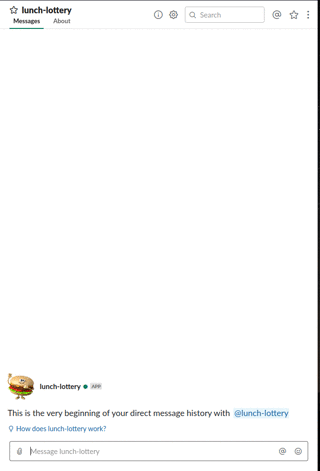
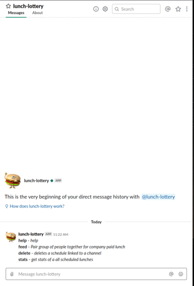
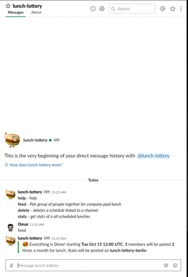
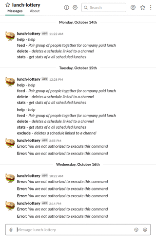

#  Lunch Roulette
A slack bot to randomize lunch buddies

## What This Is
- A slack bot using GO to schedule random lunches between members every period of time

## How to Use
**There are 5 commands available in the app:**

help | feed
--- | ---
 | 

stats | delete
--- | ---
 | 

exclude |
--- |
 |

## How to Install
### What You Need Before Deploying / Developing
- Create a new slack app in your slack workspace [link](https://api.slack.com/apps)
- Add a `.env` file following the example in the [.env_sample](.env_sample) *Note:* slack token is *Bot User OAuth Access Token* found in [https://api.slack.com/apps/<app_id>/oauth?](https://api.slack.com/apps/<app_id>/oauth?)

### Deployment
- Deploy the service wherever you want using the dockerfile included
- Make sure you have a proxy pointing to your `PORT` in [.env](env_sample) file
- Add the url pointing to the proxy to interactive messages request url field found here -> [https://api.slack.com/apps/<app_id>/interactive-messages?](https://api.slack.com/apps/<app_id>/interactive-messages?)

### Heroku
- You can also deploy using heroku by following [this guide](https://devcenter.heroku.com/articles/getting-started-with-go#deploy-the-app)
- dont forget to add the `SLACK_TOKEN`, `DB_NAME`, and `AUTH_USERS` to env vars
- **NOTE:** Heroku adds its own port to env so you should **not** do it

### Google Drive Support
- The bot supports having the db file saved to google drive, in case you cant save it on server.
- To do that you need to create a project on google cloud
- Then enable google drive api
- Create a service accoutn and get `credentials.json` content and add them as env variable as you can see here [.env](.env_sample)
- You are good to go!

### Development
- Make sure you have **docker version: 19.x+** installed
- Run `docker-compose up --build` to launch service
- Add the link found in [localhost:4040](http://localhost:4040) to [https://api.slack.com/apps/<app_id>/interactive-messages?](https://api.slack.com/apps/<app_id>/interactive-messages?) interactive messages request url field found here -> [https://api.slack.com/apps/<app_id>/interactive-messages?](https://api.slack.com/apps/<app_id>/interactive-messages?)

## Technologies Used
- Golang
- [boltDB](https://github.com/boltdb/bolt)
- [shomali11/slacker](https://github.com/shomali11/slacker)
- [nlopes/slack](https://github.com/nlopes/slack)
- [ngrok](https://ngrok.com/)
- Docker
- Docker-compose
- Google Drive Api